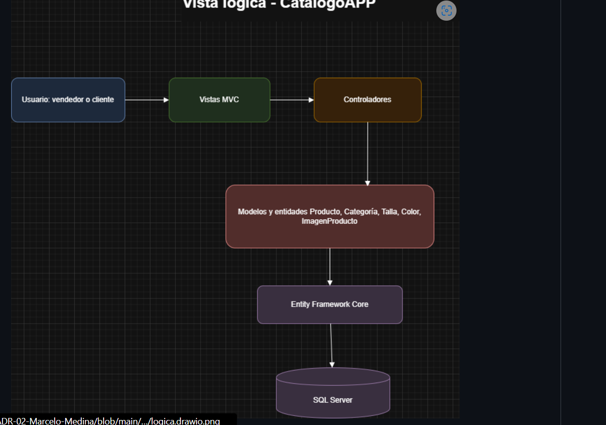
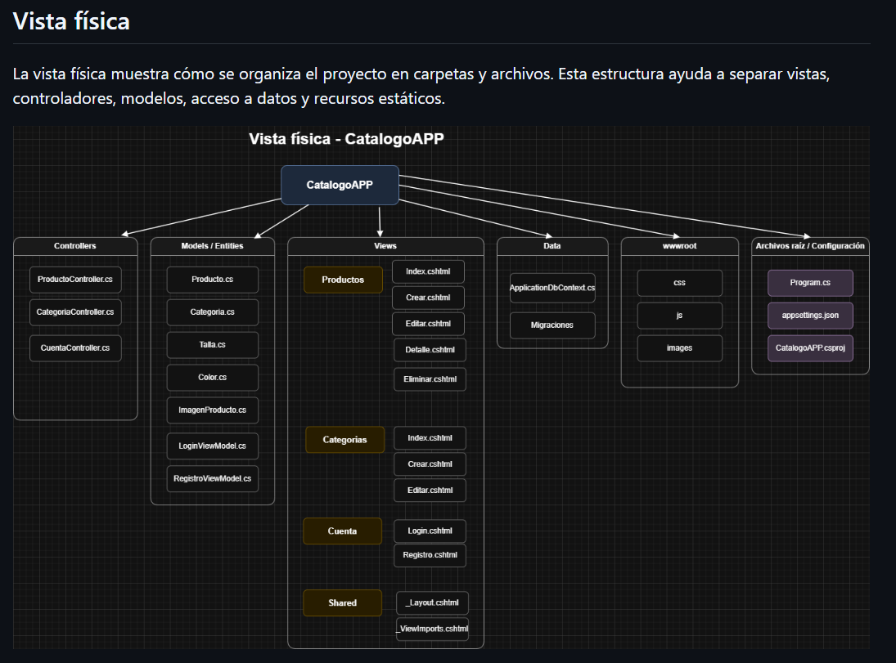
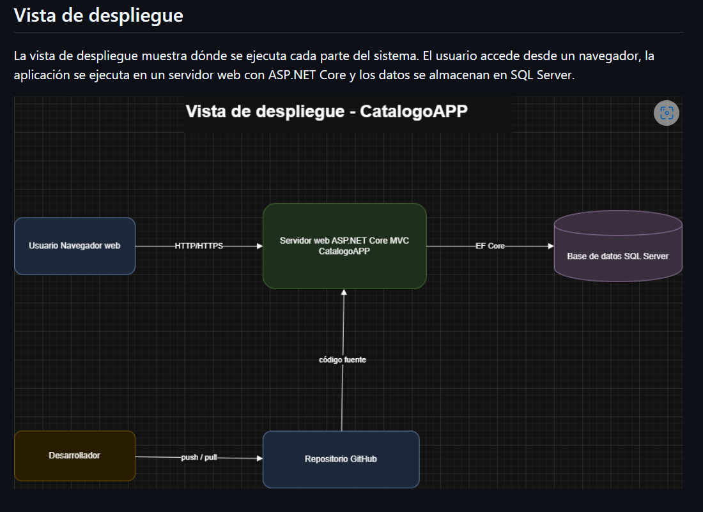
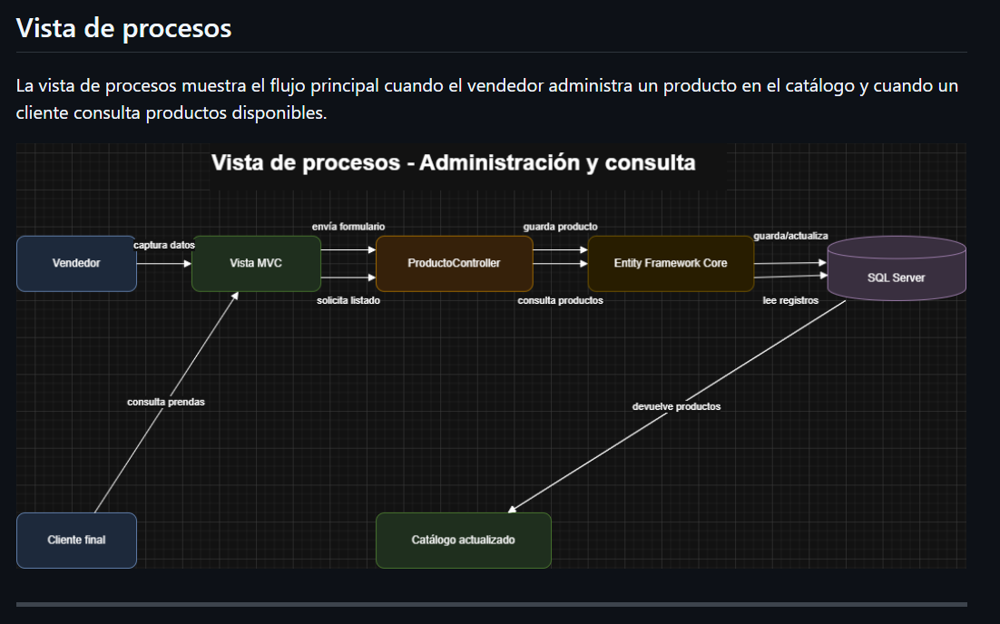
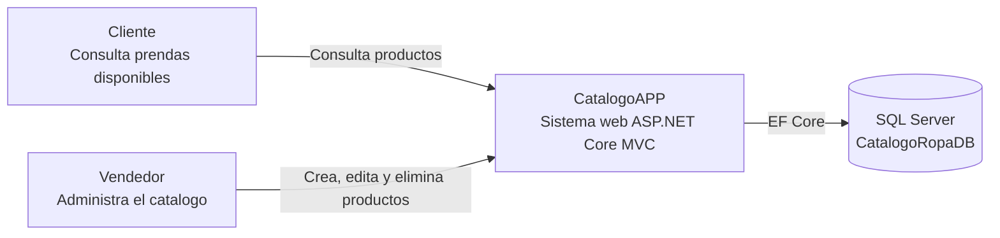
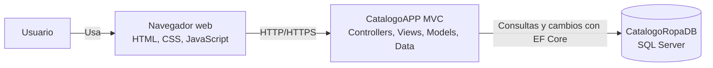

# ADR-02: Vistas arquitectónicas iniciales de CatalogoAPP

| Campo  | Valor |
|--------|-------|
| Autor  | Marcelo Medina |
| Fecha  | 05/06/2026 |
| Estado | Aceptado |

---

## Contexto

CatalogoAPP es una aplicación web para pequeños vendedores y revendedores de ropa. El sistema busca permitir la administración y visualización de productos como prendas, categorías, tallas, colores, precios e imágenes, evitando que el vendedor dependa únicamente de redes sociales, notas o archivos separados para mostrar su catálogo.

En el ADR-01 se aceptó utilizar C#, ASP.NET Core MVC, Entity Framework Core, SQL Server, arquitectura MVC y GitHub como base tecnológica del proyecto. A partir de esa decisión, este ADR documenta las vistas arquitectónicas iniciales que se usarán para explicar la estructura del sistema desde diferentes perspectivas.

La necesidad principal de esta decisión es poder defender la arquitectura en clase y tener una guía clara para continuar el desarrollo del proyecto durante el cuatrimestre.

---

## Decisión

Se decidió documentar la arquitectura inicial de CatalogoAPP mediante cuatro vistas arquitectónicas:

- **Vista lógica:** muestra la organización del sistema en capas y responsabilidades.
- **Vista física:** muestra cómo se organiza el código en carpetas, archivos y componentes del proyecto.
- **Vista de despliegue:** muestra dónde se ejecuta cada parte del sistema y cómo se comunican.
- **Vista de procesos:** muestra el flujo de operación principal cuando un vendedor administra productos y un cliente consulta el catálogo.

### ¿Por qué?

Se eligieron estas vistas porque permiten explicar el sistema desde diferentes niveles de detalle. La vista lógica ayuda a entender la separación de responsabilidades de MVC; la vista física permite ubicar el código dentro del proyecto; la vista de despliegue muestra la relación entre navegador, aplicación web y base de datos; y la vista de procesos permite explicar cómo fluye una acción real dentro del sistema.

Estas vistas ayudan a justificar que CatalogoAPP no solo es código funcional, sino un sistema diseñado con una estructura clara, mantenible y entendible.

---

## Alternativas consideradas

| Alternativa | Por qué la descarté |
|-------------|---------------------|
| Usar solo un diagrama general | No muestra suficientes perspectivas del sistema y sería más difícil defender la arquitectura. |
| Documentar únicamente MVC | MVC explica la separación del código, pero no muestra despliegue, estructura física ni flujo de procesos. |
| Usar diagramas muy detallados desde el inicio | Podría generar complejidad innecesaria para una primera versión del proyecto. |
| No documentar las vistas arquitectónicas | Haría más difícil explicar las decisiones tomadas y mantener una guía para el desarrollo. |

---

## Consecuencias

### ✅ Lo que gano

- **Consecuencia técnica:** el sistema queda mejor explicado porque cada vista muestra una parte diferente de la arquitectura.
- **Consecuencia de mantenimiento:** será más fácil ubicar dónde agregar funcionalidades como filtros, categorías, imágenes o gestión de inventario.
- **Consecuencia para el proceso:** facilita la exposición y defensa del proyecto porque permite explicar la arquitectura desde varios puntos de vista.
- **Consecuencia para el equipo:** si más adelante otra persona revisa el proyecto, podrá entender más rápido cómo está organizado.

### ⚠️ Lo que sacrifico o asumo

- **Limitación técnica:** las vistas representan la arquitectura inicial, por lo que podrían cambiar si el sistema crece o se agregan nuevas funciones.
- **Deuda o riesgo:** si el código real no se mantiene alineado con los diagramas, la documentación puede quedar desactualizada.
- **Mayor esfuerzo inicial:** se requiere invertir tiempo en documentar y actualizar los diagramas conforme avance el proyecto.

---

## Vista lógica

La vista lógica muestra las responsabilidades principales del sistema. CatalogoAPP utiliza MVC, por lo que separa la interfaz, el control de peticiones, la lógica del catálogo y el acceso a datos.

---

## Vista física

La vista física muestra cómo se organiza el proyecto en carpetas y archivos. Esta estructura ayuda a separar vistas, controladores, modelos, acceso a datos y recursos estáticos.

---

## Vista de despliegue

La vista de despliegue muestra dónde se ejecuta cada parte del sistema. El usuario accede desde un navegador, la aplicación se ejecuta en un servidor web con ASP.NET Core y los datos se almacenan en SQL Server.

---

## Vista de procesos

La vista de procesos muestra el flujo principal cuando el vendedor administra un producto en el catálogo y cuando un cliente consulta productos disponibles.

---

## C4 Nivel 1 - Contexto del sistema

El diagrama C4 de nivel 1 muestra CatalogoAPP como un sistema web utilizado por clientes y vendedores. El vendedor administra productos del catalogo, mientras que el cliente consulta prendas disponibles desde el navegador.

---

## C4 Nivel 2 - Contenedores

El diagrama C4 de nivel 2 separa los contenedores principales: navegador, aplicacion MVC y base de datos. Tambien muestra que la aplicacion concentra controladores, vistas, modelos y acceso a datos.

---

## Conclusión

La decisión de documentar CatalogoAPP mediante vistas lógica, física, de despliegue y de procesos permite explicar el sistema de forma más completa. Cada vista muestra una parte distinta de la arquitectura y ayuda a defender las decisiones iniciales tomadas para el proyecto. Además, esta documentación servirá como guía para mantener la organización del código conforme se agreguen nuevas funcionalidades.

---

## Cláusula de uso de inteligencia artificial

Para la elaboración de este documento se utilizó inteligencia artificial como herramienta de apoyo en la organización de ideas y mejora de la estructura del contenido.
