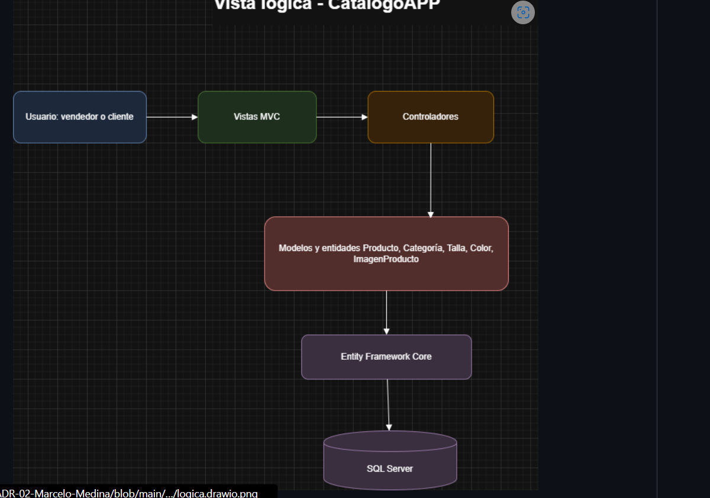
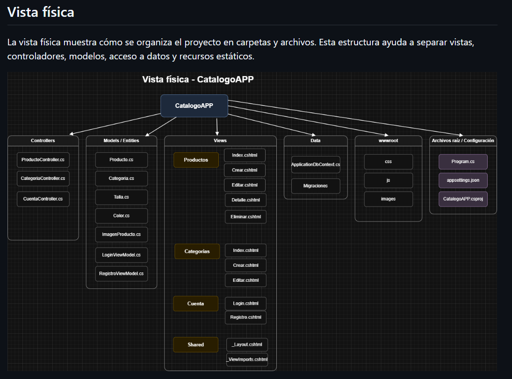
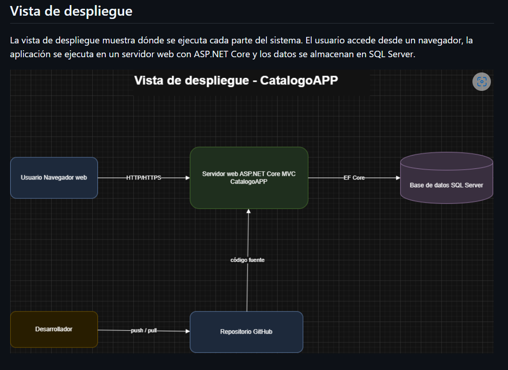
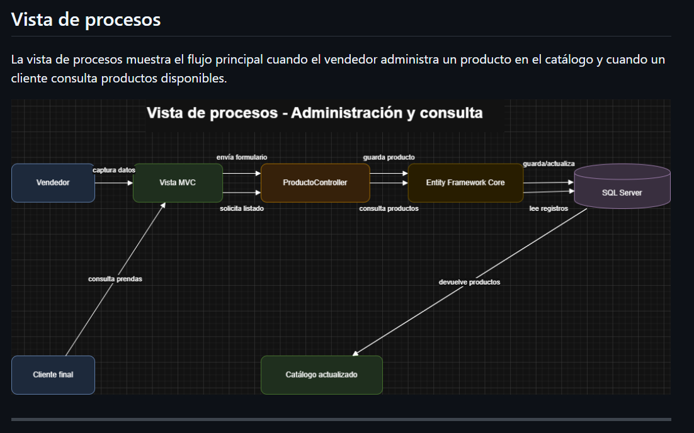

# ADR-02: Vistas arquitectónicas de CatalogoRopaMVC

| Campo | Valor |
|---|---|
| Autor | Marcelo Medina |
| Fecha | 2026-06-28 |
| Estado | Aceptado |

## Contexto

Este ADR se originó cuando el proyecto todavía se presentaba como **CatalogoAPP**. El nombre oficial de la solución final es **CatalogoRopaMVC**. La aplicación evolucionó desde una base MVC local hacia un monolito modular con Razor Views, API REST, servicios, autenticación por cookies, pruebas y despliegue en Azure.

La documentación debe permitir que estudiantes, evaluadores y desarrolladores entiendan el mismo sistema desde distintas perspectivas, sin depender de una sola imagen general ni de diagramas que contradigan el código.

## Problema arquitectónico

Una estructura de carpetas no explica por sí sola responsabilidades, dependencias, ejecución, despliegue o flujos. Se necesita una representación que permanezca útil cuando la solución cambia de LocalDB a Azure y añade nuevos componentes.

## Decisión

Se mantienen cuatro vistas complementarias y el modelo C4:

- **Vista lógica:** responsabilidades de presentación, control, aplicación, dominio y persistencia.
- **Vista física:** organización versionada del proyecto.
- **Vista de despliegue:** navegador, Azure Container Apps, Azure SQL, GitHub Actions, GHCR y recursos externos de imágenes.
- **Vista de procesos:** consulta pública y administración autenticada.
- **C4 niveles 1, 2 y 3:** contexto, contenedores y componentes en Mermaid.

Las imágenes históricas se conservan como evidencia de la etapa inicial, pero la fuente vigente y verificable es `docs/C4.md`, porque usa Mermaid versionado y refleja la implementación final.

## Justificación

Las vistas responden preguntas distintas y evitan sobrecargar un único diagrama. Mermaid puede revisarse junto con el código y GitHub lo renderiza sin depender de herramientas propietarias. C4 proporciona niveles progresivos para audiencias no técnicas y técnicas.

## Alternativas consideradas

- **Solo un diagrama general:** descartado porque oculta responsabilidades y dependencias.
- **Documentar únicamente MVC:** descartado porque no representa ejecución, persistencia ni entrega.
- **Conservar únicamente PNG de Draw.io:** sustituido como fuente principal porque es más difícil revisar cambios y puede quedar desactualizado.
- **Diagramas de clases exhaustivos:** descartados para la vista arquitectónica; el código es la fuente para detalles de tipos.

## Consecuencias positivas

- La arquitectura puede explicarse de lo general a lo específico.
- Los diagramas Mermaid son revisables mediante diff.
- La documentación distingue el estado histórico del despliegue vigente.
- Las relaciones se vinculan con clases y carpetas reales.

## Consecuencias negativas

- Cada cambio estructural requiere actualizar C4 y este ADR.
- Las imágenes históricas pueden confundir si se consultan fuera del índice.
- La vista de componentes no sustituye documentación detallada de cada método o endpoint.

## Riesgos y limitaciones

- El principal riesgo es la divergencia entre diagramas y código.
- Mermaid en GitHub admite un subconjunto de sintaxis; se usan `flowchart` y etiquetas simples para maximizar compatibilidad.
- C4 no expresa por sí solo amenazas, rendimiento o costos; ATAM y ADR-08 cubren esas perspectivas.

## Evidencia en el código

- `docs/C4.md`: niveles 1, 2 y 3 vigentes.
- `docs/img/`: vistas históricas lógica, física, de procesos y despliegue.
- `Controllers/`, `Services/`, `DTOs/`, `ViewModels/`, `Data/` y `Views/`: componentes representados.
- `.github/workflows/`: vista complementaria de entrega.

## Vista lógica

El proceso ASP.NET Core organiza presentación Razor, controladores MVC y API, servicios de aplicación, contratos, modelos y persistencia. No existe un repositorio separado: los servicios y controladores autorizados usan `ApplicationDbContext`.

## Vista física

La solución contiene el proyecto web en la raíz y el proyecto xUnit en `tests/CatalogoRopaMVC.Tests`. La documentación vive en `docs` y los workflows en `.github/workflows`.

## Vista de despliegue

La imagen siguiente refleja la etapa inicial y no debe usarse para inferir la infraestructura final. El despliegue vigente está descrito por ADR-08 y el nivel 2 de `C4.md`: Azure Container Apps Consumption, GHCR público y Azure SQL Database Free Offer.

## Vista de procesos

El visitante consulta el catálogo sin autenticación. El vendedor registra la cuenta dueña, inicia sesión mediante cookie y usa acciones protegidas para administrar. Los formularios MVC aplican antiforgery; las escrituras REST requieren rol, pero su protección CSRF permanece como riesgo.

## Relación con otros ADR

- Documenta visualmente ADR-01 y ADR-03.
- Incluye los componentes incorporados por ADR-04, ADR-05 y ADR-06.
- ADR-08 sustituye la vista de despliegue local inicial.
- ATAM utiliza estas vistas para localizar riesgos y puntos de sensibilidad.
