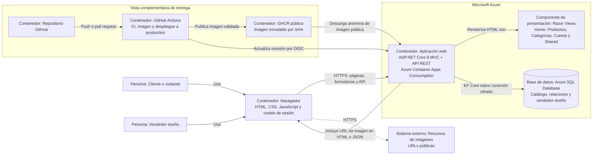
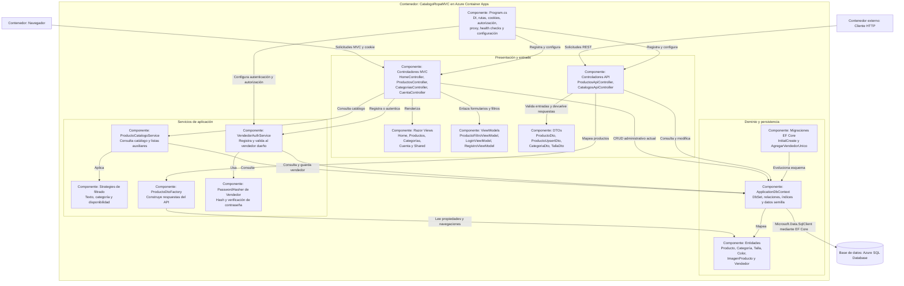

# Modelo C4 de CatalogoRopaMVC

Este documento representa la arquitectura final comprobada en el repositorio. Los diagramas usan `flowchart` de Mermaid para que GitHub pueda renderizarlos. Las etiquetas **Persona**, **Sistema**, **Contenedor**, **Componente** y **Base de datos** indican el tipo de elemento C4.

## Nivel 1 — Contexto del sistema

**Propósito:** explicar quién usa CatalogoRopaMVC, qué objetivo cumple y con qué sistemas externos reales se relaciona, sin detallar su implementación interna.

CatalogoRopaMVC publica un catálogo de ropa para visitantes y permite al vendedor dueño administrar inventario. GitHub entrega cambios validados a Azure y el navegador obtiene imágenes desde las URL externas guardadas en el catálogo.

## Nivel 2 — Contenedores

**Propósito:** mostrar las unidades de ejecución y almacenamiento, cómo se comunican y dónde se despliegan. Las Razor Views forman parte del contenedor web; no se despliegan como proceso independiente.

La aplicación ASP.NET Core MVC y API REST se publica como una sola imagen en Azure Container Apps. Usa Azure SQL Database mediante EF Core. GitHub Actions y GHCR forman la vista complementaria de entrega, no una dependencia requerida para atender cada solicitud.

## Nivel 3 — Componentes

**Propósito:** detallar los componentes reales dentro del contenedor ASP.NET Core y sus principales dependencias. No se representa una capa de repositorios porque no existe en el código.

Los controladores MVC coordinan vistas y formularios; los controladores API entregan DTOs. Los servicios de catálogo y autenticación encapsulan consultas y credenciales. Las estrategias componen filtros, la fábrica centraliza el mapeo REST y `ApplicationDbContext` concentra el acceso a SQL Server.

## Notas de consistencia

- LocalDB se conserva únicamente para desarrollo; el despliegue usa Azure SQL Database.
- MVC y API comparten el mismo proceso, revisión de Container Apps y `ApplicationDbContext`.
- Las imágenes son referencias URL; el proyecto no contiene almacenamiento de blobs.
- GitHub Actions entrega la aplicación, pero una falla de GitHub no impide atender una versión ya desplegada.
- La protección de escrituras REST con cookie y sin antiforgery se evalúa en `ATAM.md`.
