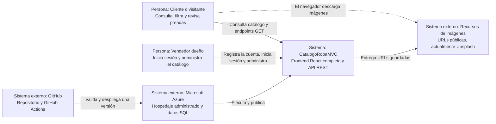
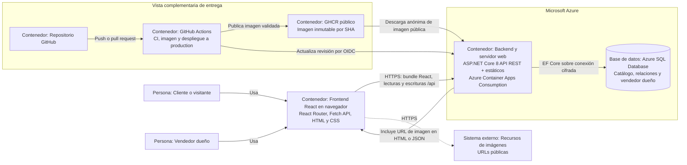
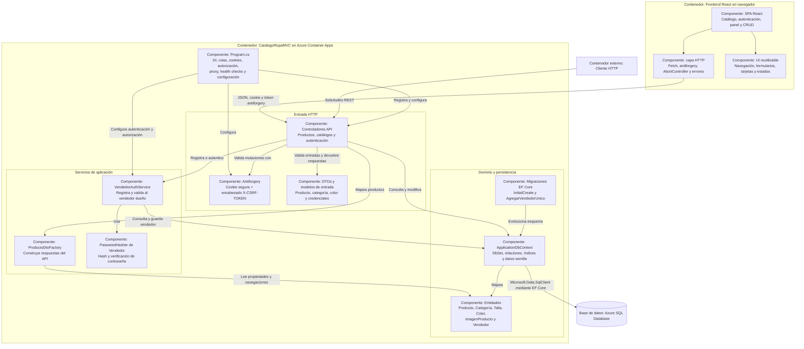

# Modelo C4 de CatalogoRopaMVC

Este documento representa la arquitectura final comprobada en el repositorio. Los diagramas usan `flowchart` de Mermaid para que GitHub pueda renderizarlos. Las etiquetas **Persona**, **Sistema**, **Contenedor**, **Componente** y **Base de datos** indican el tipo de elemento C4.

## Nivel 1 — Contexto del sistema

**Propósito:** explicar quién usa CatalogoRopaMVC, qué objetivo cumple y con qué sistemas externos reales se relaciona, sin detallar su implementación interna.

CatalogoRopaMVC publica un catálogo de ropa para visitantes y permite al vendedor dueño administrar inventario. GitHub entrega cambios validados a Azure y el navegador obtiene imágenes desde las URL externas guardadas en el catálogo.

## Nivel 2 — Contenedores

**Propósito:** mostrar las unidades de ejecución y almacenamiento, cómo se comunican y dónde se despliegan. React se ejecuta en el navegador y sus archivos se sirven desde ASP.NET Core; no se despliega como servicio independiente.

El API ASP.NET Core y el bundle compilado de React se publican como una sola imagen en Azure Container Apps. React cubre la experiencia pública y administrativa. La aplicación usa Azure SQL Database mediante EF Core. GitHub Actions y GHCR forman la vista complementaria de entrega, no una dependencia requerida para atender cada solicitud.

## Nivel 3 — Componentes

**Propósito:** detallar los componentes reales dentro del navegador y el contenedor ASP.NET Core, además de sus principales dependencias. No se representa una capa de repositorios porque no existe en el código.

React organiza páginas públicas y administrativas, componentes, hooks y una capa HTTP con antiforgery. Los controladores API entregan DTOs, autentican al vendedor y protegen las mutaciones. El servicio de autenticación encapsula credenciales, la fábrica centraliza el mapeo REST y `ApplicationDbContext` concentra el acceso a SQL Server.

## Notas de consistencia

- LocalDB se conserva únicamente para desarrollo; el despliegue usa Azure SQL Database.
- Frontend estático y API comparten el mismo proceso y revisión de Container Apps.
- React se compila en CI/Docker, se entrega dentro de `wwwroot` y se ejecuta únicamente en el navegador.
- React atiende catálogo, autenticación y CRUD; no quedan Razor Views ni controladores MVC convencionales.
- Las imágenes son referencias URL; el proyecto no contiene almacenamiento de blobs.
- GitHub Actions entrega la aplicación, pero una falla de GitHub no impide atender una versión ya desplegada.
- Todas las escrituras autenticadas con cookie exigen antiforgery; el control se evalúa en `ATAM.md`.
