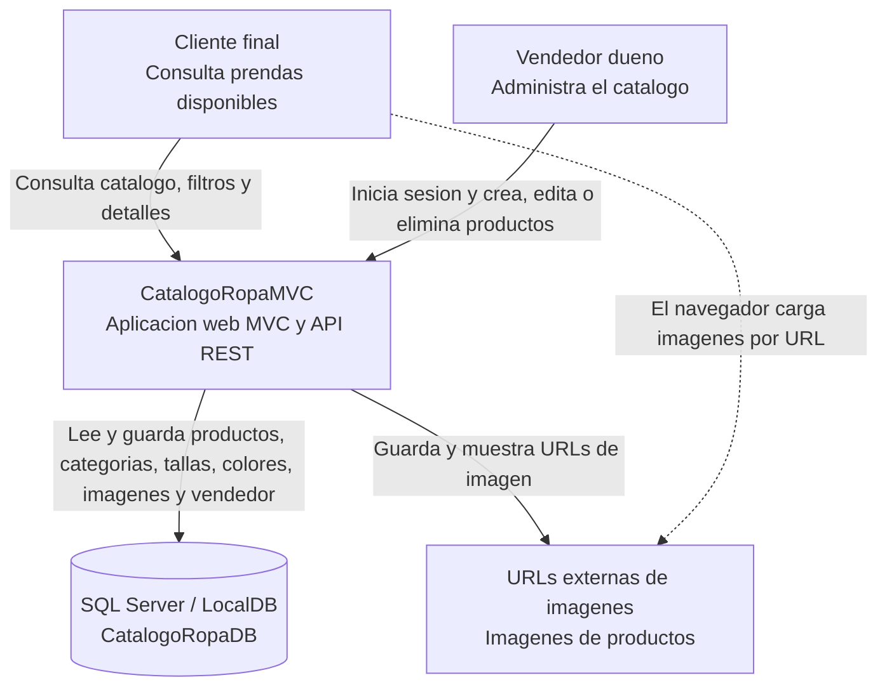

# Documentacion de arquitectura con Modelo C4

Proyecto: **CatalogoRopaMVC**

CatalogoRopaMVC es una aplicacion web individual para publicar y administrar un catalogo de ropa. La solucion usa ASP.NET Core MVC, Razor Views, Entity Framework Core, SQL Server, una API REST integrada y autenticacion por cookies para el vendedor dueno.

## C4 Nivel 1 - Contexto

**Para quien es este nivel:** personas que necesitan entender el sistema completo sin entrar en detalles tecnicos internos, como profesor, cliente o evaluador del proyecto.

**Pregunta que responde:** Que es el sistema, quien lo usa y con que sistemas externos interactua.

