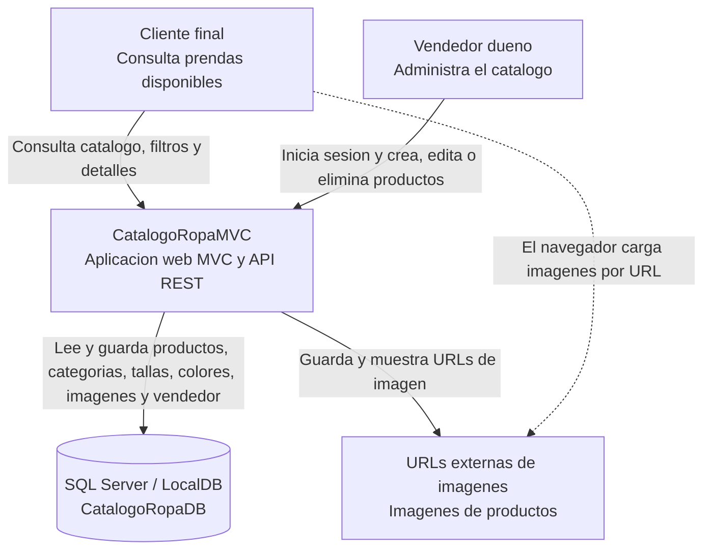
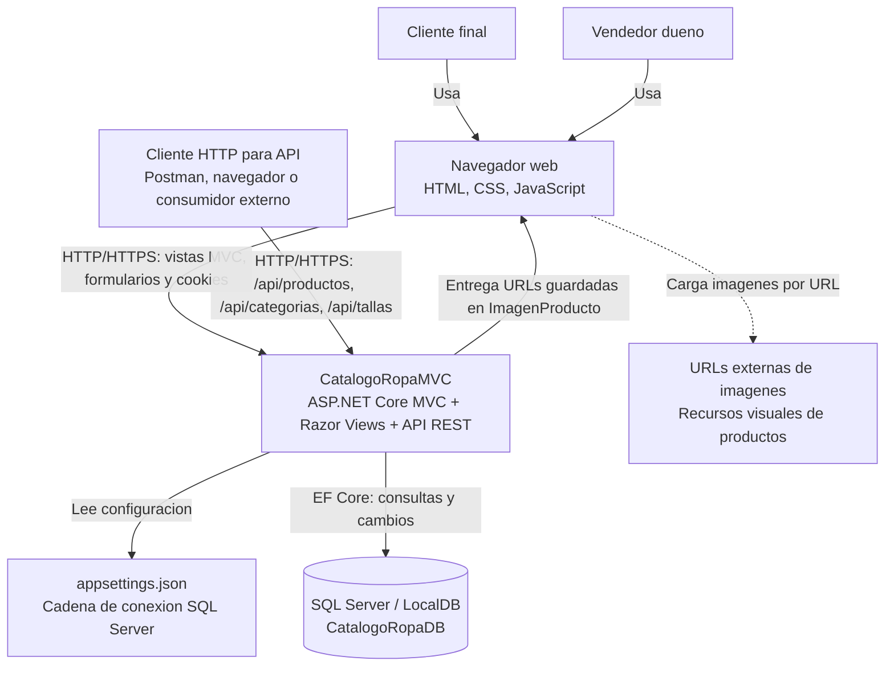
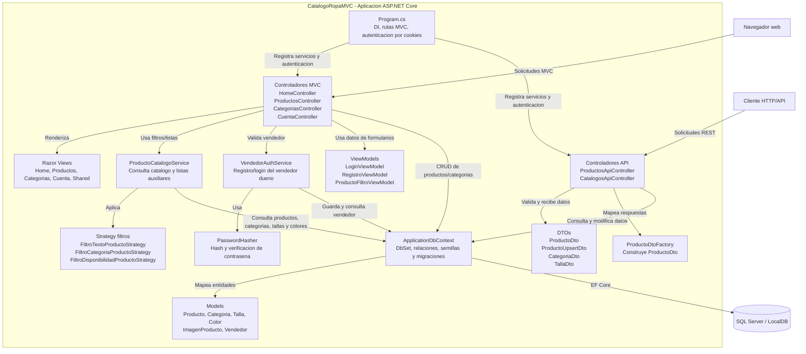

# Documentacion de arquitectura con Modelo C4

Proyecto: **CatalogoRopaMVC**

CatalogoRopaMVC es una aplicacion web individual para publicar y administrar un catalogo de ropa. La solucion usa ASP.NET Core MVC, Razor Views, Entity Framework Core, SQL Server, una API REST integrada y autenticacion por cookies para el vendedor dueno.

## C4 Nivel 1 - Contexto

**Para quien es este nivel:** personas que necesitan entender el sistema completo sin entrar en detalles tecnicos internos, como profesor, cliente o evaluador del proyecto.

**Pregunta que responde:** Que es el sistema, quien lo usa y con que sistemas externos interactua.

## C4 Nivel 2 - Contenedores

**Para quien es este nivel:** personas con perfil tecnico o semitecnico que necesitan entender las partes grandes de la solucion y sus comunicaciones.

**Pregunta que responde:** Cuales son las partes tecnicas principales del sistema y como se comunican.

## C4 Nivel 3 - Componentes

**Para quien es este nivel:** desarrolladores, profesor o revisores que necesitan entender como esta organizada internamente la aplicacion principal.

**Pregunta que responde:** Que componentes internos forman la pieza principal del sistema y que responsabilidad tiene cada uno.

La pieza principal documentada es `CatalogoRopaMVC`, que contiene la interfaz MVC, la API REST, los servicios de aplicacion, los modelos de dominio y el acceso a datos. No existe una capa de repositorios separada; el acceso a datos se concentra en `ApplicationDbContext` con Entity Framework Core.

